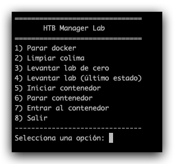
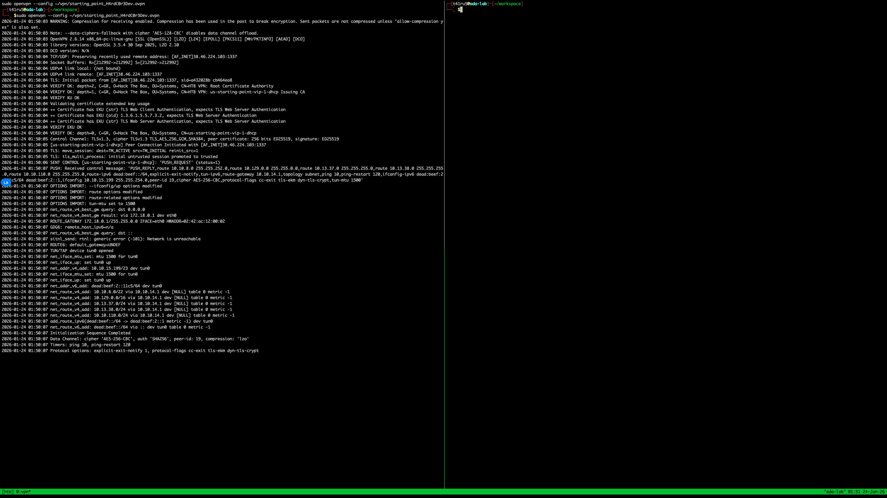
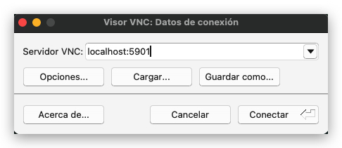
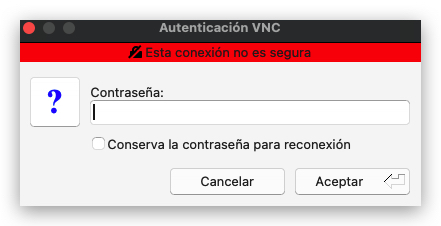
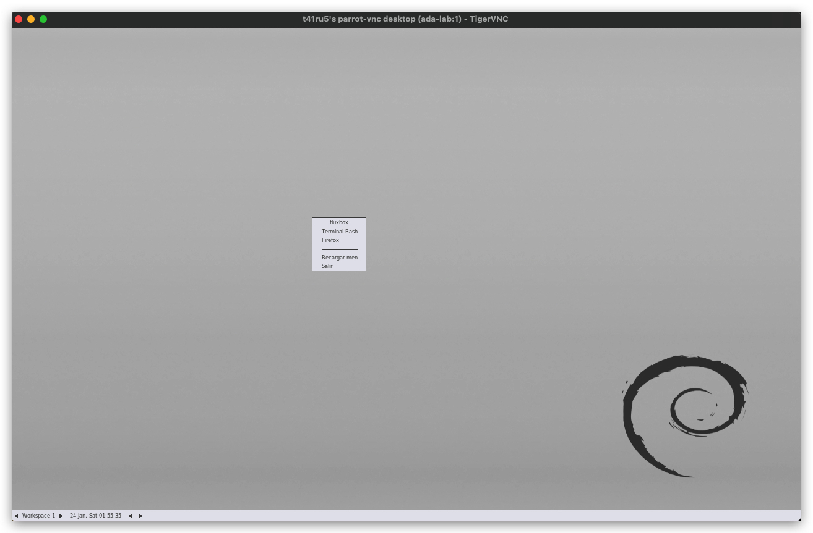

# Dockerización rápida de Parrot para Hack The Box

Este proyecto nació porque me daba **pajita** levantar una máquina virtual pesada cada vez que quería hacer una caja en Hack The Box 😅.  
Así que armé este entorno liviano y rápido en Docker, con soporte para VPN de HTB y montaje de workspace directo. Lo uso para resolver labs, entrenar, y tener todo limpio y automatizado.

## ¿Qué hace?

- Levanta un contenedor con Parrot Security Core
- Conecta automáticamente a tu VPN `.ovpn` de Hack The Box
- Monta tu carpeta `workspace` para guardar tus scripts, notas o herramientas
- Todo con un solo comando: `./uplab.sh`

## Requisitos

- Docker y Docker Compose instalados
- Archivo `.ovpn` de Hack The Box
- Permisos de ejecución para `uplab.sh`

## ⚠️ Nota sobre Docker en macOS (Apple Silicon)

Este proyecto fue desarrollado y probado en macOS utilizando **Colima** como runtime de Docker, en equipos con arquitectura **Apple Silicon (ARM64)**.
Para asegurar compatibilidad con SQL Server y algunas imágenes utilizadas, Colima se ejecuta especificando arquitectura:

```bash
colima start --disk 20 --cpu 8 --memory 8 --arch x86_64
```

# Comenzamos

## Preparando el entorno

Lo primero que demos hacer es crear los siguientes directorios

```bash
mkdir workspace
```
y

```bash
mkdir vpn
```
En primer directorio quedaran todos nuestros archivos creados desde el contendor en nuestro local.
El segundo directorio es para guardar la vpn que nos da acceso a hackthebox

## Permisos

Para que cada script funcione de forma correcta debemos darles permismos de ejecucion

```bash
chmod +x scripts/*.sh
```
Luego debemos dar permisos a nuesro menu principal

```bash
chmod +x menu.sh
```

## Menu de despliegue

Para levantar nuestro entorno tenemos un menu que se ejecuta de la siguiente manera

```bash
./menu.sh
```
Al inciar nos muestra la siguiente pantalla



Elegimos la opcion 3 para desplegar el contenedor.

Al final nos mostrara la siguiente pantalla lista para trabajar en hackthebox

Tambien tenemos una opcion visual que entramos a travez de vnc, para eso usamos TigerVNC.



Y como url en el servidor vnc colocamos 

localhost:5901

Presionamos en conectar y se nos despliega la ventana para colocar nuestra password, en mi caso es la misma que la del user.



Presionamos aceptar luego de poner nuestra password y nos despliega nuestro entorno grafico.



Desde aqui podremos usar firefox y otras herramientas graficas que vallamos necesitando.

desarrollado por vmonsalve.